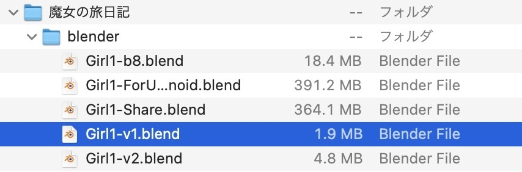
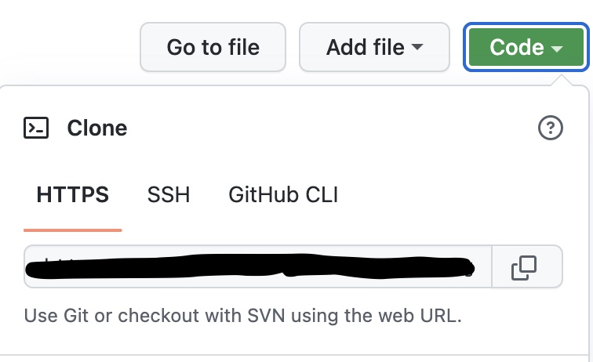
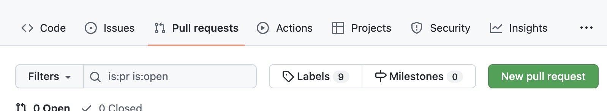

# Gitを始めよう
- 55代 ヘビ
--- 

# こんな経験をしたことありませんか？

--- 

## 別名をつけてバージョン管理する



--- 

## 別名をつけてバージョン管理する
- 状況
    - バージョン毎に別名をつけてファイルを保存している。 
        => 一部同じデータを持つファイルが複数存在している。
        =>（なんとも言えない容量の無駄遣いにストレージさんもﾆｯｺﾘ）  
        => **差分(前回から変わった分)だけ保存したい！！**


git: （ちらっ..）

--- 

## プログラムを誰かと一緒に書いているとき
- 開発者A: 「5000行あるソースコードの一部変更した！」
- 開発者B: 「どの部分変えたの？」
- 開発者A: 「a行目とb行目とc行目と....あぁめんどくせぇ！どこが変わったか直接ソースコード読め！！覚えてねえよ！！」
- 開発者B: 「5000行今から全て読み返せと？」
- 開発者C: 「あ、あの〜、僕も変更してる最中なのですが...開発者Aさんの変更箇所と統合するのどうしたらいいですか...」
- 開発者達: 「つらい....**変更箇所だけいい感じに見れたらいいのに...**」


--- 

## プログラムを誰かと一緒に書いているとき
- 状況
    - 開発者A: ソースコードの一部を変更した。しかしソースコードが巨大すぎて、他の開発者が**ソースコードのどこが変わったか**を見つけるのが困難。
    - 開発者B: **何もしていなかった**。
    - 開発者C: 同じタイミングで変更していた。開発者Aの**変更した箇所と被らないように**統合できると良いのだけど... 


git: （ちらっ...ちらっ.....）

--- 
 
# gitが解決します！！
- git: 「差分だけ保存するので容量少なくて済むで〜」
- git: 「差分を辿っていつでも昔のバージョンに戻せるで〜〜」
- git: 「差分が被っていなかったら、いい感じに2つの差分を統合できるで〜」
- git: 「(ブランチを切り替えて)違うバージョンを同時に編集できるで〜〜〜」
- git: 「GitHubっていう皆使ってるオンラインの場所があるで〜〜」
- ﾄﾞﾔｧ...: 「git」
 

--- 

# 使ってみよう

--- 

# GitHubアカウントの作成 & gitのダウンロード  

--- 

# GitHubアカウントの作成
- GitHubとは?
    - Gitを利用したソースコード管理サービス
    - オープンソースいっぱいあるます
- https://github.com/ へアクセスしてGitHubアカウントを作成する。
- アカウントができたら[MISW organization](https://github.com/MISW)に招待するので教えてください！

--- 

# gitのダウンロード
- Windows: 
    - [Git for Windows](https://gitforwindows.org/)からダウンロードする
    - gitを起動する => configを設定する
        - ```git config --global user.name "name"```
        - ```git config --global user.email "email@email"```

--- 

# gitの実践 

---

## gitによるバージョン管理を始める
- ```git init```: .gitフォルダが作られ、このコマンドを実行したディレクトリ以下がgitに管理されるようになる。最初に一度だけ実行する。
- ```git status```: 状況を確認する。
- ```git add ${ファイルやディレクトリ名}```: gitのコミット対象にする。
- ```git commit -m "${コミットメッセージ}"```: コミットする（変更をgitに記録するイメージで良いかも） 

### 付録
- gitに管理させたくないものは```.gitignore```ファイルに記述することでgitが無視するようにできる。 

--- 

## 昔のコミット時の状態に戻す。
- ```git log -${件数}```: 昔のコミットを見る。コミットメッセージからそのコミットがどんなコミットかを確認する。```${件数}```には件数を数字で入力する。
- ```git checkout ${コミットのハッシュ値} .```: カレントディレクトリの全てのファイルを選択した```${コミットのハッシュ値}```の時点に戻す(=古いバージョンに戻す)。

--- 

## ブランチを分ける
- ブランチを分ける=コミット先を分ける。
- これによって、同時並行でブランチ毎に異なる開発を進めることができる。
- ```git branch```: 現在いるブランチを確認する
- ```git checkout -b ${新しいブランチ名}```: 新しいブランチを作る。
- ```git checkout ${ブランチ名}```: 現在いるブランチを変える。
- ```git merge ${統合したいブランチ名}```: 他のブランチを現在のブランチに統合する 

### 付録: ブランチ戦略について
- 世間の皆さんはブランチの使い方について色々考えています。[参考](https://qiita.com/trsn_si/items/cfecbf7dff20c64628ea)ﾄﾞｿﾞ。
- よくある戦略(だと勝手に思っているもの)は、mainブランチには**安定して動くもの**だけ置いておき、開発は他のブランチでやること。これによって「開発してる途中でバグって動かなくなってしまったやばいどうしよう...」でもmainブランチは無事なので安心。 

--- 

## GitHubを使って共同開発する (clone)
- ```git clone ${URL}```: GitHubのレポジトリを手元にダウンロードする。
  

- cloneが終わったら、cloneしたレポジトリへカレントディレクトリを移動する。
    - ```cd ${cloneしたレポジトリのあるディレクトリ}```

--- 

### GitHubを使って共同開発する (clone後の確認)
- ```git remote -v```: リモートのレポジトリのURLを表示する。originとして「clone元のURL」が正しく表示されていればオッケー。
- ```git pull origin ${ブランチ名}```: リモートの変更を手元に持ってくる。
- ```git push origin ${ブランチ名}```: ローカルの変更をリモートにあげる。

--- 

### GitHubを使って共同開発する (ブランチを統合する）
- GitHubではpull request(通称プルリク)を出してブランチを統合することができる。



- プルリクを受けとった人は，どこが変わったか確認した後にマージする。

--- 

### 共同開発ワークロード
1. 誰かがGitHubレポジトリを作る
2. GitHubレポジトリをcloneして手元に落とす。
3. ブランチを切る。 ```git checkout -b ${new_branch_name}```
4. 手元で開発する
    1. リモートの変更をpullして手元に持ってくる。
        1. ```git pull origin ${branch_name}``` 
    1. 手元で変更を加えたのち、変更をコミットする。
        1. ```git status```
        2. ```git add ${file}```
        3. ```git commit -m "${commit message}"```
    2. リモートにpushする。
        1.  ```git push origin ${branch_name}```
5. プルリクを出して複数人の変更を統合する。4.に戻る。

--- 

# 実践してみよう 
- [MISW2022年度gitテスト用レポジトリ](https://github.com/MISW/git_practice_2022)をcloneする。
    - [MIS.W organization](https://github.com/MISW)に参加している必要がある。 
- 自分のハンドルネームでブランチを切る。
- ```test/```ディレクトリ配下に自分の名前で好きなファイルを作成する。
- add、commit、pushを行った後、プルリクエストを飛ばす。
- 正しくできてたらOK！ もうGit(GitHub)を使って共同開発できますね！！

---

# Gitを始める会 〜End〜
- お疲れ様でした！！！
